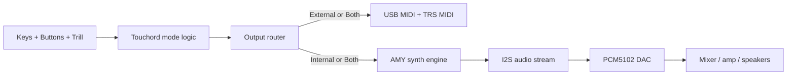
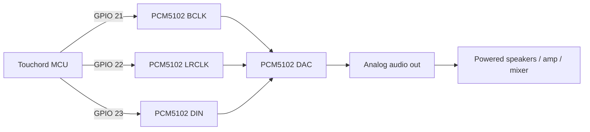
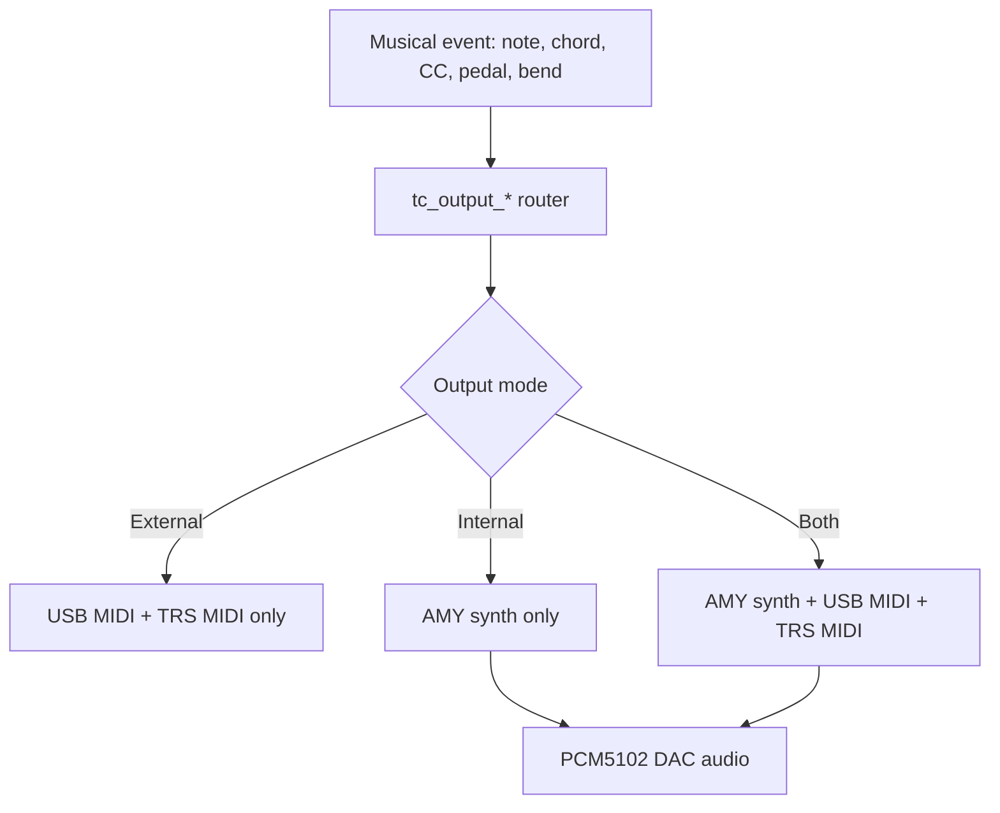
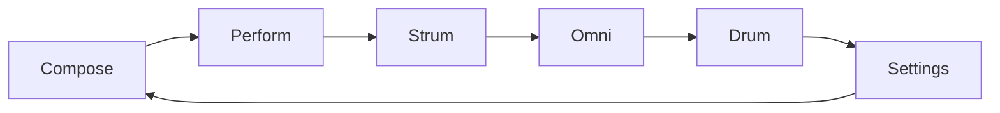
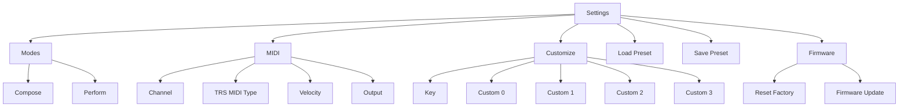
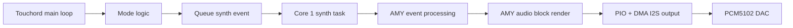

# Touchord Built-In Synth Manual

## Printable Study Guide

This guide is the detailed, print-friendly manual for Touchord with the built-in AMY synth path enabled.

For the best result, open this file in a Markdown viewer that renders Mermaid diagrams before printing. The diagrams are included directly in the document so you can study the system as both an instrument and a piece of embedded hardware.

## 1. What Touchord Is Now

Touchord is no longer only a MIDI controller.

With the current firmware, it can behave in three ways:

| Output Mode | What You Hear | What Leaves the Device |
| --- | --- | --- |
| `External` | No internal sound | USB MIDI and TRS MIDI |
| `Internal` | The built-in AMY synth | No normal note output to external synths |
| `Both` | The built-in AMY synth | USB MIDI and TRS MIDI |

The important idea is that Touchord still thinks like a chord instrument first. The keys, buttons, and Trill bar generate musical events. Those events are then routed either to MIDI, to the internal synth, or to both.



### Important current limitations

- `Drum` mode is still external-only.
- `Perform` mode plays notes internally, but its Trill-bar CC gestures do not yet audibly shape the internal synth.
- The built-in synth currently starts with one fixed AMY patch and a fixed synth slot.
- `Load Preset` and `Save Preset` appear in the menu, but the current code does not yet connect those items to real preset storage behavior.

## 2. Front Panel Mental Model

Touchord has four main input and feedback zones:

- `3 control buttons`
- `7 chord keys`
- `1 Trill touch bar`
- `1 OLED display`

Here is the logical layout used in this manual:

```text
Control Buttons:   [B1] [B2] [B3]

Trill Bar:         [-------------------------------------]

Chord Keys:        [K1] [K2] [K3] [K4] [K5] [K6] [K7]

OLED:              status, chord name, mode name, settings menus
```

This is a logical diagram, not a mechanical drawing. If your enclosure differs, the firmware behavior still matches the numbering and roles described below.

### Control buttons

Touchord uses the three control buttons consistently enough that you can build muscle memory:

| Button | Usual Role |
| --- | --- |
| `B1` | Advance to the next mode, or exit Settings |
| `B2` | Usually octave down, or Back in Settings |
| `B3` | Usually octave up, or Enter/Apply in Settings |

### Chord keys

The seven chord keys do not simply map to seven fixed MIDI notes in the main chord modes.

Instead, they usually mean:

- scale degree selection
- chord selection inside the active key
- or, in drum mode, direct note triggering

### Trill bar

The Trill bar changes meaning depending on the mode:

- reshape a chord
- strum across notes
- send expressive control values
- set drum velocity
- scroll menus in Settings

That reuse is one of the most important things to understand. Touchord is intentionally small, so the same physical surface does many jobs.

## 3. System Hardware Overview

Touchord’s current built-in synth design still depends on an external DAC board for audio output.

### Core hardware roles

| Hardware Part | Role |
| --- | --- |
| RP2040 / Pico-class MCU | Runs firmware, scans inputs, runs AMY, streams audio |
| OLED | Displays current mode, chord names, menu state |
| Trill bar | Touch position and touch size input |
| Buttons and keys | Performance and navigation input |
| USB | Power, MIDI, and CDC serial |
| TRS MIDI | External MIDI output |
| PCM5102 DAC | Converts the internal digital audio stream to analog audio |

### Built-in audio wiring

The current firmware expects the DAC on these pins:

| Touchord Pin | Signal | DAC Pin |
| --- | --- | --- |
| `GPIO 21` | `BCLK` | Bit clock |
| `GPIO 22` | `LRCLK` | Left/right clock |
| `GPIO 23` | `DATA` | Audio serial data |



### What happens if no DAC is connected

- `External` mode still works normally.
- `Both` still sends MIDI externally.
- `Internal` still runs the synth engine in software, but you will not hear local sound.

## 4. Startup and Status

When Touchord powers on:

1. USB and board hardware initialize.
2. Buttons and keys are configured.
3. I2C starts for the Trill bar and OLED.
4. TRS MIDI output is configured.
5. The OLED splash screen appears.
6. Custom scales are loaded.
7. The play mode starts in `Compose`.
8. The output router initializes.
9. Core 1 starts the synth audio task.

That last point matters: the synth engine and audio streaming are running in the background even before you choose `Internal` mode.

### Default startup state

| Setting | Default |
| --- | --- |
| Mode | `Compose` |
| Output mode | `Both` |
| MIDI channel | `0` |
| TRS MIDI type | `Type A` |
| Velocity | `100` |

### LED behavior

The status LED reflects USB state:

| LED Pattern | Meaning |
| --- | --- |
| Fast blink | USB not mounted |
| Slow blink | USB mounted |
| Very slow blink | USB suspended |

The firmware also sends an all-notes-off style panic when USB mount state changes, which helps avoid hanging notes.

## 5. Output Routing and What It Means Musically

Touchord’s most important new behavior is the output router.



### External mode

Use `External` when:

- you want to drive another synth
- you are recording MIDI
- you want the classic Touchord behavior

### Internal mode

Use `Internal` when:

- you want standalone play without a computer or external synth
- you want to hear only the built-in sound
- you are practicing the instrument itself

### Both mode

Use `Both` when:

- you want a built-in reference sound while also sending MIDI
- you want to layer external gear with the internal synth
- you want to practice on local audio while still recording MIDI

### Special Drum rule

`Drum` mode overrides the normal output expectations:

- external MIDI is always enabled
- internal synth playback is disabled

This is not a bug in the manual. It is how the current firmware is written.

## 6. Mode Cycle

Press `B1` to advance through modes:



Every mode transition clears sounding notes so the instrument stays stable.

## 7. Playing Fundamentals

Before learning the individual modes, learn these four global ideas.

### A. Octave

Buttons `B2` and `B3` usually move the current octave down or up. The meaning is slightly mode-specific, but the mental model is always the same: you are shifting where the generated notes sit.

### B. Extension count

In chordal and strumming modes, extension count changes how many notes are used from the chord stack.

For example, a lower extension count feels leaner and simpler, while a higher count feels fuller.

### C. Trill segments

Touchord often divides the Trill bar into virtual segments. The segments are not printed on the hardware, but the firmware treats zones of the bar as separate selections.

Examples:

- five zones for chord reshaping
- a note lane across chord tones and octaves
- ten zones for menu scrolling in Settings

## 8. Compose Mode

Compose mode is the best place to understand how Touchord thinks harmonically.

### What Compose mode is for

Compose mode lets you:

- choose a scale degree with a key
- generate a chord automatically in the current key
- reshape that chord with the Trill bar

### How to use it

1. Press one of the seven chord keys.
2. Watch the OLED update with the chord name.
3. Slide on the Trill bar to change the chord shape.
4. Release the key to stop the chord, unless sustain is enabled.

### Compose controls

| Control | Action |
| --- | --- |
| `B1` | Move to `Perform` |
| `B2` | Octave down |
| `B3` | Octave up |
| Trill bar | Change degree behavior or inversion, depending on setting |

### Compose Trill behavior

Compose mode has two internal styles:

- `Degree`
- `Inversion`

When `Degree` is selected:

- the bar changes extension count and parallel behavior
- you are effectively morphing how the chord is voiced and colored

When `Inversion` is selected:

- the bar changes inversion
- the same chord identity is redistributed differently

### Why Compose mode is strong with the internal synth

Compose mode sends exact note-off and note-on changes only for notes that actually changed in the chord. That makes it feel clean and controlled with the built-in synth.

### Study exercise

Print this page and try:

1. Play all seven chord keys slowly.
2. For each key, sweep the Trill bar from one side to the other.
3. Notice which parts of the chord stay stable and which parts change.

## 9. Perform Mode

Perform mode is Touchord’s expressive chord-hold mode.

### What Perform mode is for

Perform mode lets you:

- hold a chord with a key
- use the Trill bar as a continuous performance surface
- send two control values based on touch position and size

### How to use it

1. Press a chord key.
2. Hold the chord.
3. Slide on the Trill bar.
4. Release the key to stop the chord.

### Perform controls

| Control | Action |
| --- | --- |
| `B1` | Move to `Strum` |
| `B2` | Octave down |
| `B3` | Octave up |
| Trill bar | Sends position CC and size CC |

### The built-in synth response

In the current firmware:

- note playback works in `Internal`
- the Trill bar still sends CC-style performance data
- the internal AMY path now converts that CC data into audible filter cutoff and filter modulation changes

So Perform mode currently behaves like this:

| Output setting | Result |
| --- | --- |
| `External` | Best full expression for external synths |
| `Internal` | Chords sound, but touch expression is limited |
| `Both` | Internal note playback plus external expressive control |

### Study exercise

Try the same chord in `External`, `Internal`, and `Both`.

Listen for the difference:

- in `External`, a mapped synth can respond deeply to the bar
- in `Internal`, the sound currently changes mainly because the notes change, not because the bar maps to internal filter motion

## 10. Strum Mode

Strum mode turns the Trill bar into a note lane.

### What Strum mode is for

Use Strum mode when you want:

- harp-like note picking
- arpeggiated movement across a chord
- a very tactile relationship between touch position and note choice

### How to use it

1. Hold a chord key to define the chord.
2. Touch the Trill bar to start a note.
3. Move along the bar to retrigger notes as you cross segments.
4. Lift your finger to stop the current note.

### Strum controls

| Control | Action |
| --- | --- |
| `B1` | Move to `Omni` |
| `B2` | Octave down |
| `B3` | Octave up |
| Double `B2` | Decrease extension count |
| Double `B3` | Increase extension count |

### Why Strum mode is one of the best standalone modes

Strum mode has a very direct relationship between touch motion and note triggering. The internal synth path handles this cleanly, so it feels immediate and playable even without external gear.

### Study exercise

Pick one chord and keep the key held. Then:

1. Move slowly across the Trill bar.
2. Repeat using 2, 3, and 4-note extension counts.
3. Listen to how denser chord stacks create a different strum lane.

## 11. Omni Mode

Omni mode adds a sustained low backing interval and moving upper notes.

### What Omni mode is for

Use Omni mode when you want:

- an Omnichord-like feel
- a sustained harmonic bed
- motion on top of a fixed harmonic base

### How to use it

1. Press a chord key.
2. Touchord starts a lower root and fifth.
3. Move across the Trill bar to add upper notes in motion.
4. Release to stop the moving notes and backing tones.

### Omni controls

| Control | Action |
| --- | --- |
| `B1` | Move to `Drum` |
| `B2` | Octave down |
| `B3` | Octave up |
| Double `B2` | Decrease octave span |
| Double `B3` | Increase octave span |

### Why Omni mode is good with the built-in synth

Omni mode creates a complete little texture:

- low harmonic support
- moving tones on top
- a stable musical center

That makes it especially satisfying in `Internal` mode.

## 12. Drum Mode

Drum mode is intentionally simpler and more direct.

### What Drum mode is for

Drum mode maps the seven keys to direct note triggers instead of chord generation.

### How to use it

1. Choose the octave.
2. Touch the Trill bar to set velocity.
3. Press keys to send drum notes.

### Drum controls

| Control | Action |
| --- | --- |
| `B1` | Move to `Settings` |
| `B2` | Octave down |
| `B3` | Octave up |
| Trill bar | Sets drum velocity |

### Important limitation

Drum mode currently does not use the internal AMY synth. It always behaves as an external MIDI drum trigger mode.

If you want to hear local sound, switch out of Drum mode and use `Compose`, `Strum`, or `Omni`.

## 13. Settings Mode

Settings mode is how you configure Touchord from the device itself.

### Settings navigation rules

| Control | Action |
| --- | --- |
| `B1` | Exit Settings to `Compose` |
| `B2` | Go back one menu level |
| `B3` | Enter or apply |
| Trill bar | Scroll or change value |
| Chord keys | Select which per-key entry is being edited in certain menus |

### Settings tree



### Settings sections you should learn first

#### Modes

Use this section to set:

- Compose-mode behavior
- Compose sustain
- Perform CC numbers and reset behavior

#### MIDI

Use this section to set:

- MIDI channel
- TRS Type A or Type B
- default velocity
- output routing: `External`, `Internal`, `Both`

#### Customize

Use this section to define:

- the active key and scale
- the four custom scales

#### Firmware

Use this section to:

- reset to factory defaults
- jump into firmware update mode

### Menu items you should treat as unfinished

`Load Preset` and `Save Preset` exist in the current menu structure, but the present code does not yet implement real stored-preset behavior behind them. For now, use the rest of the Settings system and the serial interface instead.

## 14. Built-In Synth Behavior

The built-in synth is intentionally conservative in this firmware version.

### What the synth engine does today

- starts on core 1
- initializes AMY with audio and MIDI device handling disabled inside AMY itself
- uses a Touchord-owned audio backend
- loads one startup patch
- allocates a 6-voice internal synth
- renders audio blocks continuously
- writes those blocks to the PCM5102 DAC through I2S



### What this means as a player

- the internal sound is currently stable and direct
- it is meant to make the instrument playable as a self-contained unit
- it is not yet a deep on-device synth editor

### User-visible synth features that are active

| Feature | Status |
| --- | --- |
| Polyphonic note playback | Active |
| Note-off handling | Active |
| All notes off | Active |
| Program change support in engine | Active, but not exposed in normal UI |
| Sustain pedal support in engine | Active, but not exposed in normal UI |
| Pitch bend support in engine | Active, but not exposed in normal UI |
| Perform-mode CC mapping to local synth | Active |
| Internal drum playback | Not yet implemented |

## 15. Quick Start Scenarios

### Scenario A: Use Touchord as a standalone synth

1. Connect the PCM5102 DAC.
2. Connect the DAC to speakers or an amp.
3. Power Touchord over USB.
4. Go to `Settings -> MIDI -> Output`.
5. Select `Internal`.
6. Return to `Compose`, `Strum`, or `Omni`.
7. Play.

### Scenario B: Practice with local sound and send MIDI to other gear

1. Connect the DAC for local audio.
2. Connect USB MIDI or TRS MIDI to your external synth.
3. Set `Settings -> MIDI -> Output` to `Both`.
4. Play normally.

### Scenario C: Use Touchord exactly like the old controller

1. Leave the DAC disconnected if you want.
2. Set `Settings -> MIDI -> Output` to `External`.
3. Use the device as a MIDI controller.

## 16. Serial Settings Interface

Touchord exposes a USB CDC serial interface for advanced users.

### Basic commands

```text
read
write {"octave":5,"extension_count":4,"inversion":0,"velocity":100,"mode":0,"octave_count":3,"cutoff":0,"channel":0,"output_mode":1}
```

### Output mode values

| Value | Meaning |
| --- | --- |
| `0` | External |
| `1` | Internal |
| `2` | Both |

### Recommendation

For everyday use, prefer the on-device Settings menu. Use the serial interface when you want scripted or repeatable setup changes.

## 17. Troubleshooting

### I set Output to Internal but hear nothing

Check:

- the DAC is connected
- `GPIO 21`, `22`, and `23` are wired correctly
- the DAC output is actually feeding speakers or an amp
- you are not in `Drum` mode

### I hear the built-in synth, but Drum mode is silent

That is expected. Drum mode currently does not use the internal synth path.

### Perform mode feels less expressive internally than externally

That should no longer be true after the current AMY update. The notes play internally, and the Trill CC messages now drive audible filter and modulation changes on the built-in synth.

### I changed modes and my note stopped

That is intentional. Touchord clears notes on mode transitions to prevent hanging notes.

### I changed output mode and my note stopped

That is also intentional. Output mode changes trigger all-notes-off for safety.

### USB connect or disconnect changed what I was hearing

The firmware triggers a panic clear when USB mount state changes. This helps protect against stuck notes during hot-plug events.

## 18. Best Modes for Study and Practice

If you are learning the instrument itself, use this sequence:

1. `Compose`
2. `Strum`
3. `Omni`
4. `Perform`
5. `Drum`

Why this order works:

- `Compose` teaches the harmonic model
- `Strum` teaches the Trill bar as a note lane
- `Omni` teaches texture and movement
- `Perform` teaches expressive control concepts
- `Drum` is musically simple but currently less relevant to the built-in synth path

## 19. One-Page Study Summary

If you only remember a few things, remember these:

- `B1` cycles modes.
- `B2` and `B3` usually move octave or edit values.
- `Compose`, `Strum`, and `Omni` are the best current standalone synth modes.
- `Perform` works internally for notes, but not yet for rich synth modulation.
- `Drum` is external-only right now.
- `Settings -> MIDI -> Output` is the switch that turns Touchord into a standalone synth.
- No DAC means no local audio, even though the synth engine is running.

## 20. Final Practical Advice

If your goal is to sit with the instrument and really learn it, use this setup:

- set `Output` to `Internal`
- start in `Compose`
- move to `Strum`
- then spend time in `Omni`
- keep a printed copy of the mode cycle and settings tree nearby

If your goal is to use Touchord as both a composition tool and a controller, use:

- `Both` output mode
- the built-in synth as your monitoring sound
- external MIDI for richer downstream synthesis

Touchord is already useful as a standalone instrument in this firmware. The built-in synth path is deliberately simple, but it is musically real, stable, and worth learning on its own terms.
