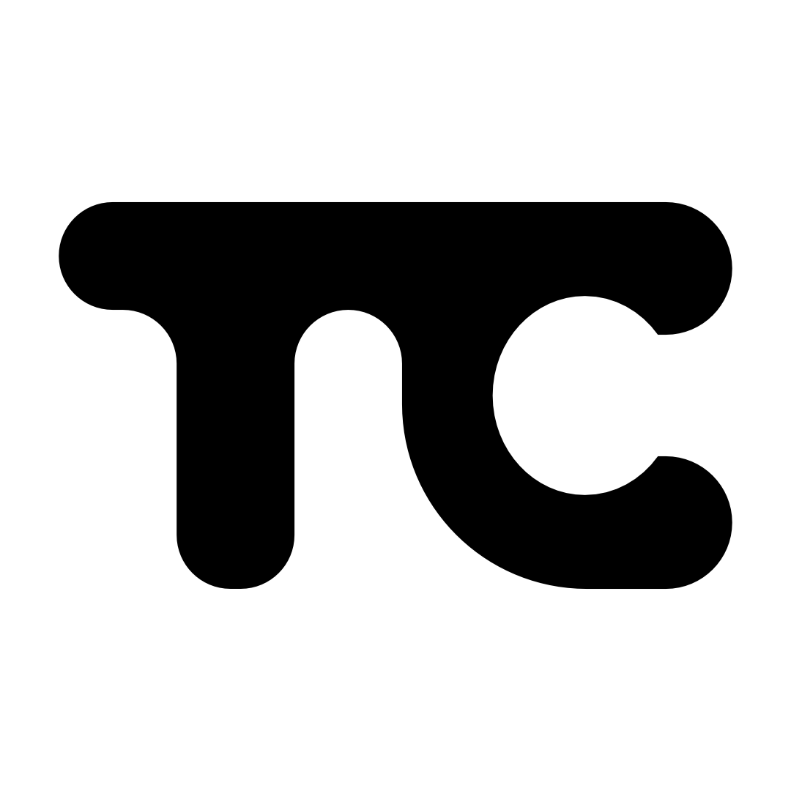
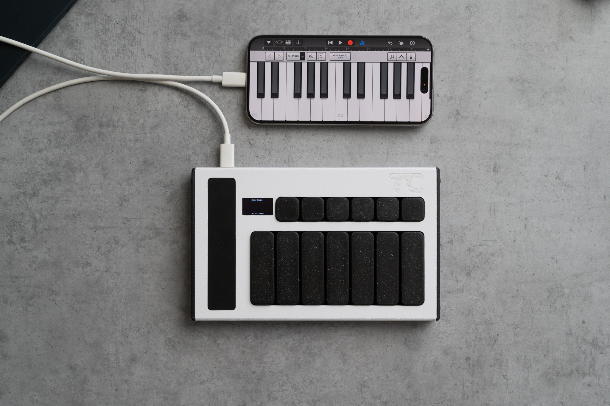
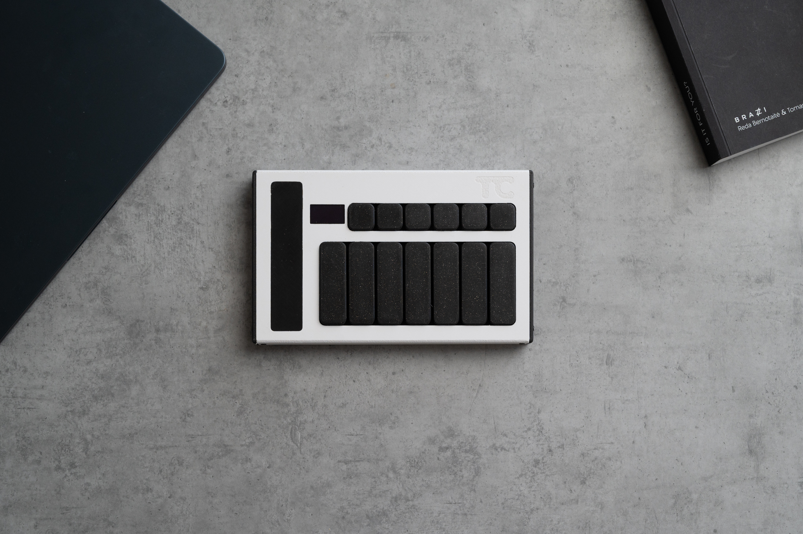

# Touchord

  

Touchord is an open source chord-generating MIDI controller featuring a touch bar interface. It is designed for musicians seeking versatile chordal playing and performance options and for makers looking for a highly modifyable product with a realistic and fun use.

## [TOUCHORD DIY KIT PRE-ORDERS](https://daugdara.com/products/touchord-diy-kit)

## Motivation

Making music without formal training is hard. Learning theory takes time, and when the goal is to create and express ideas quickly, it can feel tedious. Chord progressions and harmony are crucial yet difficult to master; exploring by ear works, but entering complex chords on guitar or piano is slow. That is where chord‑generating synths and MIDI controllers help.

**Why not buy an existing similar device?** Many are closed‑source and built by unestablished companies with limited support histories. When projects are abandoned or parts become unavailable, devices turn into e‑waste.

Touchord addresses these problems. Components are common, 3D‑printable, or manufacturable at a reasonable cost, thus repairs and replacements remain feasible. Open development also streamlines bug fixes and issue tracking because contributors can help accelerate software improvements. And if we for some reason stop developing new updates or cannot contribute anymore, community still remains along with the source code and all the production files, keeping the project alive.

## Features

- **Three Operating Modes:**
  - **Strum Mode:** Harp style playing for plucked synths.
  - **Omni Mode:** An omni-chord style play mode mimicking the strumming of an omnichord.
  - **Composer Mode:** Allows adjustment of chord qualities directly via the touch bar for chord customization.
  - **Perform Mode:** Uses the touch bar’s pressure sensitivity for expressive live performances.

- **Chord Layout:**
  - Each key corresponds to a chord degree in a musical key.
  - Supports custom musical keys and customizable chords on each key.

- **Hardware:**
  - Uses the RP2350 microcontroller chip.
  - Programmed with the PicoSDK in C.
  - Cherry MX style mechanical switches.
  - 6 control buttons.
  - 7 chord keys sized 3u, equipped with 3u plate-mounted stabilizers for enhanced stability.
  - Touch bar: [Trill Bar by Bella](https://bela.io/products/trill/) ([GitHub](https://github.com/BelaPlatform/Trill)) providing multi-touch and pressure sensing.
  - Display: Standard 0.96" 128x64 OLED SSD1306 screen.

- **Enclosure:**
  - Combination of 3D printed carbon fiber reinforced PETG base and CNC machined aluminum top.
  - Optionally, the top can also be fabricated via 3D printing.

- **Connectivity:**
  - USB Type-C MIDI support.
  - TRS MIDI support (User switchable in software):
    - **TRS Type A (Standard MIDI TRS)**
    - **TRS Type B (Roland TRS MIDI)**

---

## Showcase

  
  
  

## Projects based on Touchord

### "Ghetto" Touchord made using Pico 2W by [nlpeeee](https://github.com/nlpeeee/TCw)
  
---

*Find the Trill Bar by Bella:* [https://bela.io/products/trill/](https://bela.io/products/trill/) 
*Trill Bar GitHub repository:* [https://github.com/bela-platform/trill](https://github.com/BelaPlatform/Trill)  
