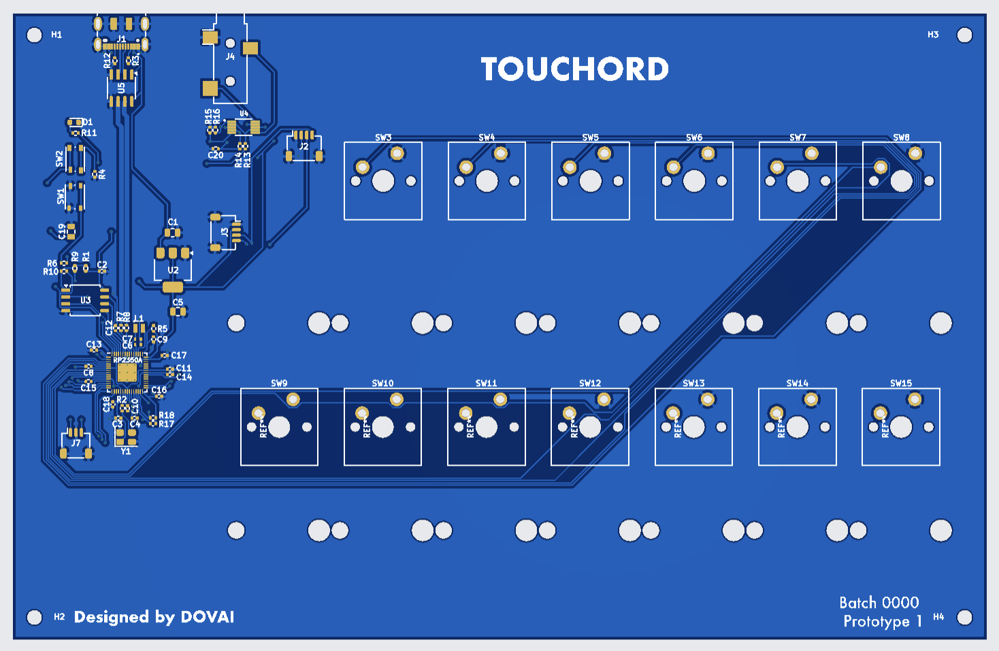

# Touchord

Touchord is an open source chord-generating MIDI controller featuring a touch bar interface. It is designed for musicians seeking versatile chordal playing and performance options and for makers looking for a highly modifyable product with a realistic and fun use.

## Motivation

Making music without formal training is hard. Learning theory takes time, and when the goal is to create and express ideas quickly, it can feel tedious. Chord progressions and harmony are crucial yet difficult to master; exploring by ear works, but entering complex chords on guitar or piano is slow. That is where chord‑generating synths and MIDI controllers help.

**Why not buy an existing similar device?** Many are closed‑source and built by unestablished companies with limited support histories. When projects are abandoned or parts become unavailable, devices turn into e‑waste.

Touchord addresses these problems. Components are common, 3D‑printable, or manufacturable at a reasonable cost, thus repairs and replacements remain feasible. Open development also streamlines bug fixes and issue tracking because contributors can help accelerate software improvements. And if we for some reason stop developing new updates or cannot contribute anymore, community still remains along with the source code and all the production files, keeping the project alive.

## Features

- **Three Operating Modes:**
  - **Strum Mode:** An omni-chord style play mode mimicking the strumming of an omnichord.
  - **Composer Mode:** Allows adjustment of chord qualities directly via the touch bar for deep chord customization.
  - **Perform Mode:** Uses the touch bar’s pressure sensitivity for expressive live performances.

- **Chord Layout:**
  - Each key corresponds to a chord degree in a musical key.
  - Supports custom musical keys and customizable chords on each key.

- **Hardware:**
  - Uses the RP2350 microcontroller chip.
  - Programmed with the PicoSDK in C.
  - Cherry MX style mechanical switches.
  - 6 control buttons.
  - 7 chord keys sized 3u, equipped with 3u plate-mounted stabilizers for enhanced stability.
  - Touch bar: [Trill Bar by Bella](https://bela.io/products/trill/) ([GitHub](https://github.com/BelaPlatform/Trill)) providing multi-touch and pressure sensing.
  - Display: Standard 0.96" 128x64 OLED SSD1306 screen.

- **Enclosure:**
  - Combination of 3D printed carbon fiber reinforced PETG base and CNC machined aluminum top.
  - Optionally, the top can also be fabricated via 3D printing.

- **Connectivity:**
  - USB Type-C MIDI support.
  - TRS MIDI support implementing the two most popular MIDI modes:
    - **TRS Type A (Standard MIDI TRS)**
    - **TRS Type B (Roland TRS MIDI)**

## Project Stage

- Enclosure design and manufacturing are finished.
- PCB prototype is already made and tested, and a final board with more expandable and flexible features is at the last stage of production.
- Software is at a prototype stage. All the backend features are done, UI and UX remain.

- ### Next steps?

1. Launch IndieGoGo campaign and start the funding process;
2. Finalize hardware;
3. CE and RoHS certification;
4. Finalize Software, with Beta testing to improve overall user experience;
5. Manufacture and fulfill IndieGoGo orders. Touchord was designed with simple manufacturing in mind;
6. Improve the software with updates and encourage the community to customize and expand the project to their needs.

## Versions

Users will be able to select from three versions:

1. **Case-less Kit:**  
   For DIY enthusiasts wanting to customise the enclosure and mechanical switches.

2. **3D Printed Model:**  
   Features a carbon fiber PETG base and glass fiber PETG top, providing a sturdy printed enclosure.

3. **Premium Metal Model:**  
   Includes a CNC machined aluminum top for a high-end aesthetic and durability.

---

## Visuals

  
  
  
*(Images show design renders from different angles and PCB layout)*

---

*Find the Trill Bar by Bella:* [https://bela.io/products/trill/](https://bela.io/products/trill/) 
*Trill Bar GitHub repository:* [https://github.com/bela-platform/trill](https://github.com/BelaPlatform/Trill)  
