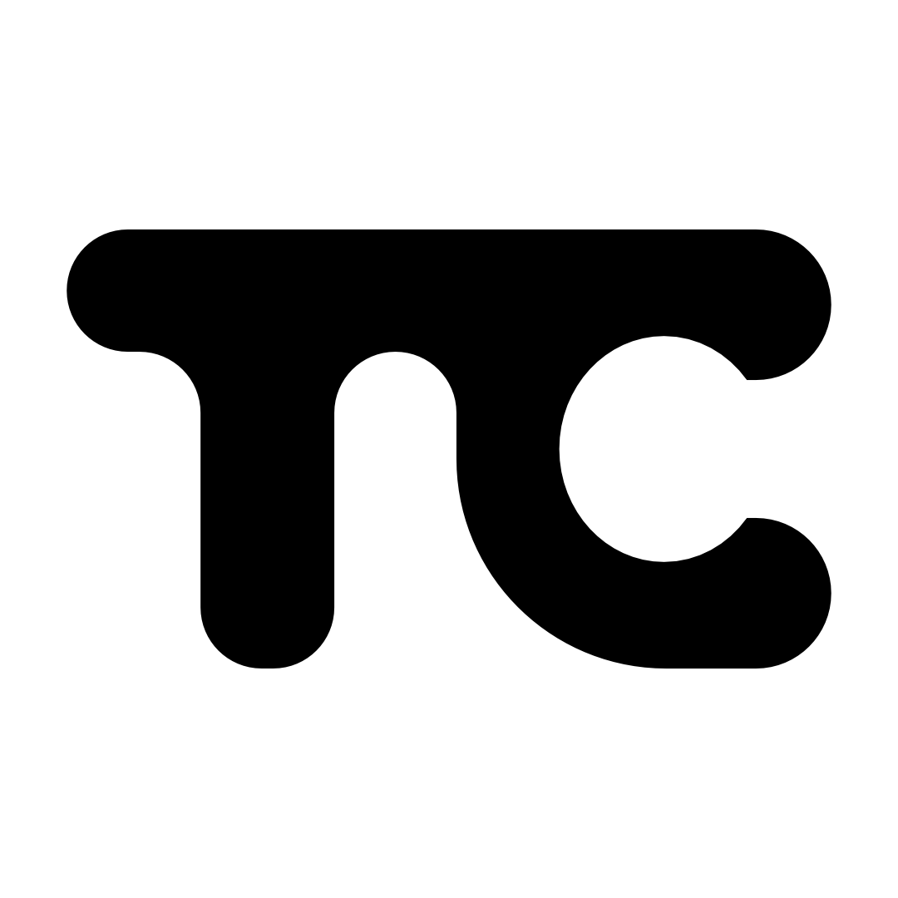
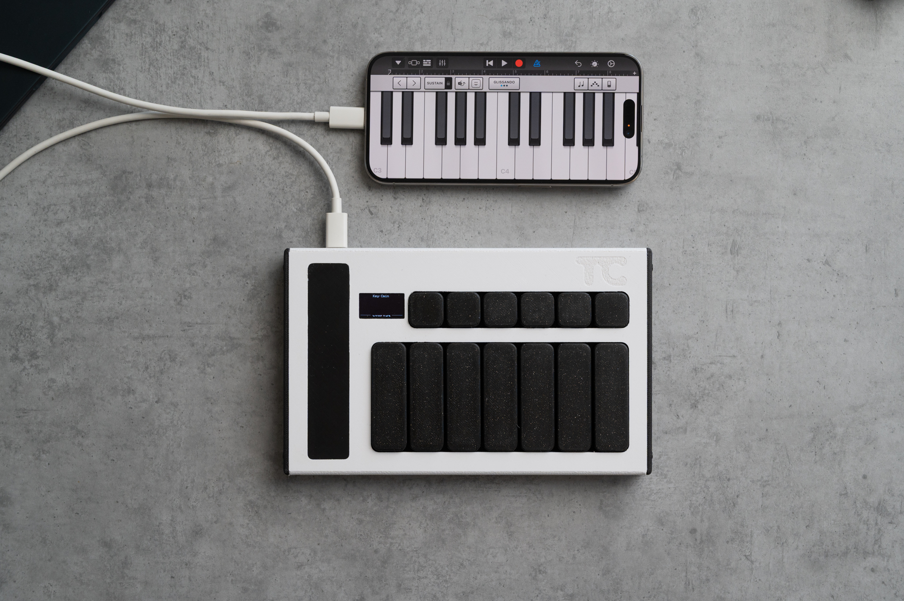
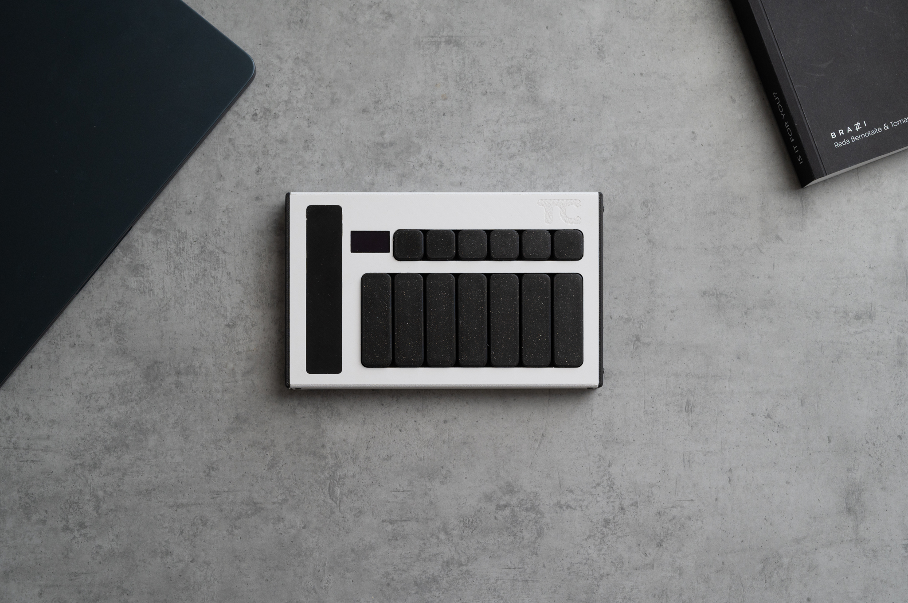
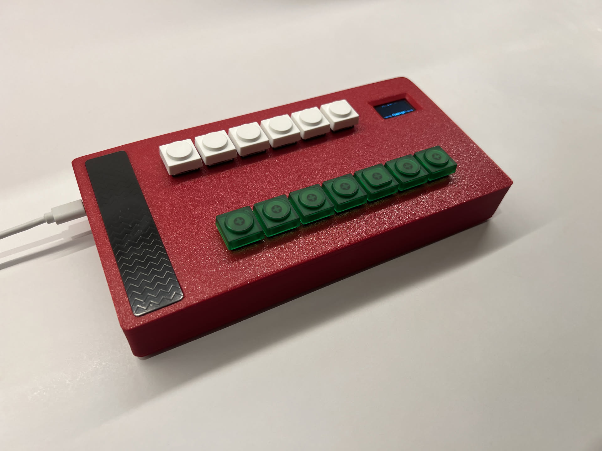

# Touchord
<p align="center">  </p>

Touchord is an open source chord-generating MIDI controller featuring a touch bar interface. It is designed for musicians seeking versatile chordal playing and performance options and for makers looking for a highly modifyable product with a realistic and fun use.

## [TOUCHORD DIY KIT PRE-ORDERS](https://daugdara.com/products/touchord-diy-kit)

## Motivation

Making music without formal training is hard. Learning theory takes time, and when the goal is to create and express ideas quickly, it can feel tedious. Chord progressions and harmony are crucial yet difficult to master; exploring by ear works, but entering complex chords on guitar or piano is slow. That is where chord‑generating synths and MIDI controllers help.

**Why not buy an existing similar device?** Many are closed‑source and built by unestablished companies with limited support histories. When projects are abandoned or parts become unavailable, devices turn into e‑waste.

Touchord addresses these problems. Components are common, 3D‑printable, or manufacturable at a reasonable cost, thus repairs and replacements remain feasible. Open development also streamlines bug fixes and issue tracking because contributors can help accelerate software improvements. And if we for some reason stop developing new updates or cannot contribute anymore, community still remains along with the source code and all the production files, keeping the project alive.


## Features

- **Five Operating Modes:**
  - **Strum Mode:** Harp style playing for plucked synths.
  - **Omni Mode:** An omni-chord style play mode mimicking the strumming of an omnichord.
  - **Composer Mode:** Allows adjustment of chord qualities directly via the touch bar for chord customization.
  - **Perform Mode:** Uses the touch bar’s pressure sensitivity for expressive live performances.
  - **Drum Mode:** Maps the keybed to individual notes while the touch bar controls playing velocity.

- **Chord Layout:**
  - Each key corresponds to a chord degree in a musical key.
  - Supports custom musical keys and customizable chords on each key.

- **Hardware:**
  - Uses the RP2350 microcontroller chip.
  - Programmed with the PicoSDK in C.
  - Cherry MX style mechanical switches.
  - 3 control buttons.
  - 7 chord keys sized 3u, equipped with 3u plate-mounted stabilizers for enhanced stability.
  - Touch bar: [Trill Bar by Bella](https://bela.io/products/trill/) ([GitHub](https://github.com/BelaPlatform/Trill)) providing multi-touch and pressure sensing.
  - Display: Standard 0.96" 128x64 OLED SSD1306 screen.

- **Enclosure:**
  - Combination of 3D printed carbon fiber reinforced PETG base and CNC machined aluminum top.
  - Optionally, the top can also be fabricated via 3D printing.

- **Connectivity:**
  - USB Type-C MIDI support.
  - TRS MIDI support (User switchable in software):
    - **TRS Type A (Standard MIDI TRS)**
    - **TRS Type B (Roland TRS MIDI)**

## Firmware Development Quick Start

If you are coming from the Arduino IDE, the main difference is that this project uses the Raspberry Pi Pico SDK and a normal C build system:

- `CMakeLists.txt` describes the firmware target and its dependencies.
- `cmake` configures the build.
- `ninja` or `cmake --build` compiles the firmware.
- `picotool` or BOOTSEL mode flashes the generated `.uf2`.

The firmware target is `Touchord`, and the build creates `Touchord.uf2`, `Touchord.elf`, and related outputs in `build/`.

### Prerequisites

You need:

- Raspberry Pi Pico SDK
- ARM Embedded GCC (`arm-none-eabi-gcc`)
- `cmake`
- `ninja`
- `picotool` for command-line flashing

The checked-in VS Code settings expect a Pico SDK layout under `~/.pico-sdk/`, for example:

```sh
export PICO_SDK_PATH="$HOME/.pico-sdk/sdk/2.2.0"
export PICO_TOOLCHAIN_PATH="$HOME/.pico-sdk/toolchain/14_2_Rel1"
export PATH="$PICO_TOOLCHAIN_PATH/bin:$HOME/.pico-sdk/cmake/v3.31.5/bin:$HOME/.pico-sdk/ninja/v1.12.1:$HOME/.pico-sdk/picotool/2.1.1/picotool:$PATH"
```

If you prefer an IDE, install the Raspberry Pi Pico VS Code extension and point it at the same SDK/toolchain locations. The repository already includes `.vscode/` tasks for compile, flash, and debug.

### Build From the Terminal

From the repository root:

```sh
cmake -S . -B build -G Ninja
cmake --build build
```

The project already sets `PICO_BOARD` to `pico2`, so no extra board flag is normally needed. If the build directory gets into a bad state, delete it and configure again.

### Flash the Firmware

For a first flash, the simplest method is BOOTSEL mode:

1. Put the RP2350 board into USB boot mode.
2. Build the project.
3. Copy `build/Touchord.uf2` to the mass-storage drive exposed by the boot ROM.

If `picotool` can see the board, you can flash directly:

```sh
picotool load build/Touchord.uf2 -fx
```

Once the firmware is already running, the on-device path `Settings -> Firmware -> Firmware Update` should jump back to BOOTSEL mode.

### VS Code Workflow

If you want something closer to an IDE experience:

1. Open the repository in VS Code.
2. Install the Raspberry Pi Pico extension if prompted.
3. Make sure the SDK and toolchain paths match your local install.
4. Run the `Compile Project` task to build.
5. Run the `Run Project` task to flash with `picotool`.
6. Use the included Cortex-Debug launch profiles for OpenOCD-based debugging.

## Hardware Smoke Test

There is no automated hardware test suite yet, so a manual smoke test is the expected validation path after firmware changes.

### Basic Bring-Up

1. Power the board over USB.
2. Confirm the OLED initializes and shows the Touchord splash screen.
3. Confirm the host computer enumerates both a USB MIDI device and a USB CDC serial device.

### Input and Mode Checks

1. In the default Compose mode, press the 7 chord keys and confirm the OLED chord label updates and your MIDI monitor receives note on/off events.
2. Use the first control button to cycle modes. The current order in firmware is `Compose -> Perform -> Strum -> Omni -> Drum -> Settings -> Compose`.
3. In Perform mode, hold a key and slide on the Trill bar. You should see MIDI CC changes for position and pressure/size.
4. In Strum mode, hold a key and move across the Trill bar. Notes should retrigger as you cross segments.
5. In Omni mode, hold a key and move across the Trill bar. You should hear paired notes with a sustained root/fifth feel.
6. In Drum mode, press keys to send drum notes; moving on the Trill bar should change the displayed velocity.

### Settings and MIDI Output Checks

1. Enter Settings mode and verify that the touch bar scrolls menu values.
2. In Settings mode, the second control button goes back and the third control button enters or applies the selected item.
3. In `Settings -> MIDI`, change channel, velocity, and TRS type and confirm the behavior updates.
4. If TRS MIDI is wired, verify output on the hardware jack after switching between Type A and Type B.

### Serial Settings Editor

The firmware also exposes a simple text command interface over USB CDC at `115200` baud. You can use the included `settings_editor.html` in a Chromium-based browser with Web Serial support:

1. Open `settings_editor.html`.
2. Click `Connect`.
3. Click `Read` to pull the current settings JSON from the device.
4. Edit values and click `Write` to push them back.

The raw serial commands are:

```text
read
write {"octave":5,"extension_count":4,"inversion":0,"velocity":100,"mode":0,"octave_count":3,"cutoff":0,"channel":0,"key":{"Root":"C","Quality":4}}
```

If a change touches settings parsing, MIDI routing, or mode state, test both the on-device menu and the serial editor path before considering the change complete.

---

## Showcase

[](https://www.youtube.com/watch?v=dFS27xT5Rgg)
  
  
  

## Projects based on Touchord

### "Ghetto" Touchord made using Pico 2W by [nlpeeee](https://github.com/nlpeeee/TCw)
  
---

*Find the Trill Bar by Bella:* [https://bela.io/products/trill/](https://bela.io/products/trill/) 
*Trill Bar GitHub repository:* [https://github.com/bela-platform/trill](https://github.com/BelaPlatform/Trill)  
