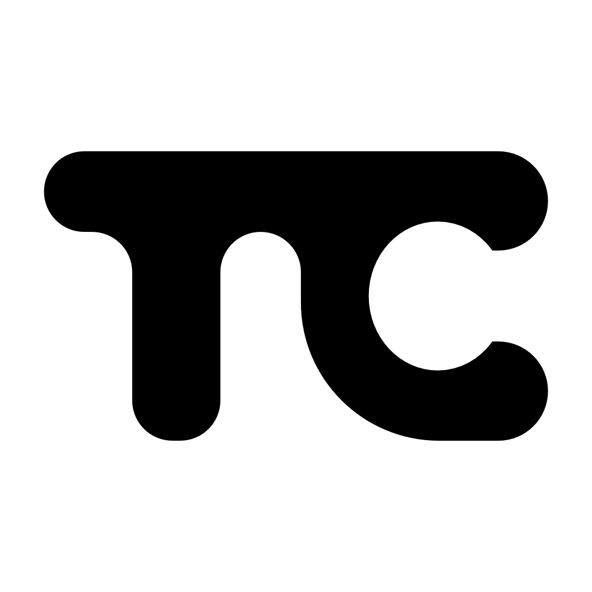
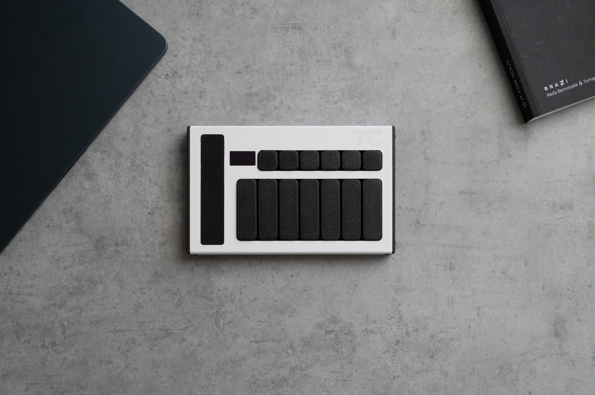
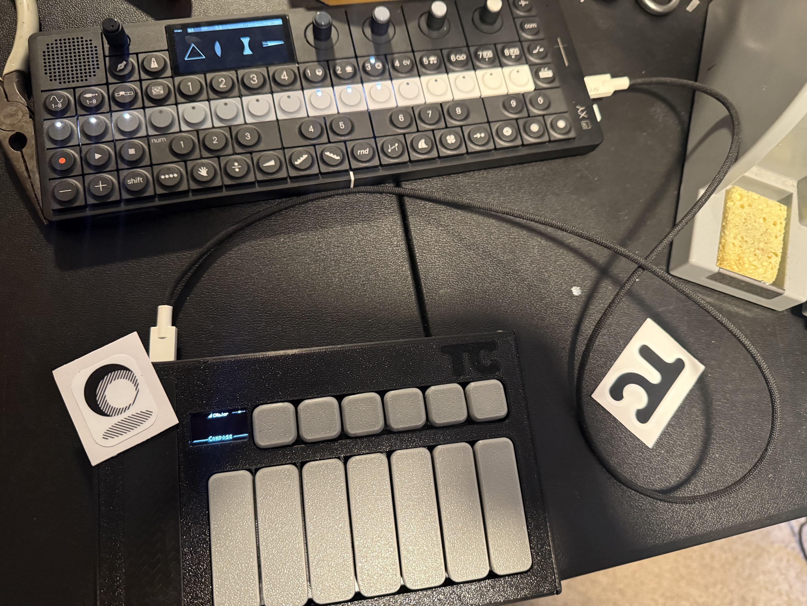
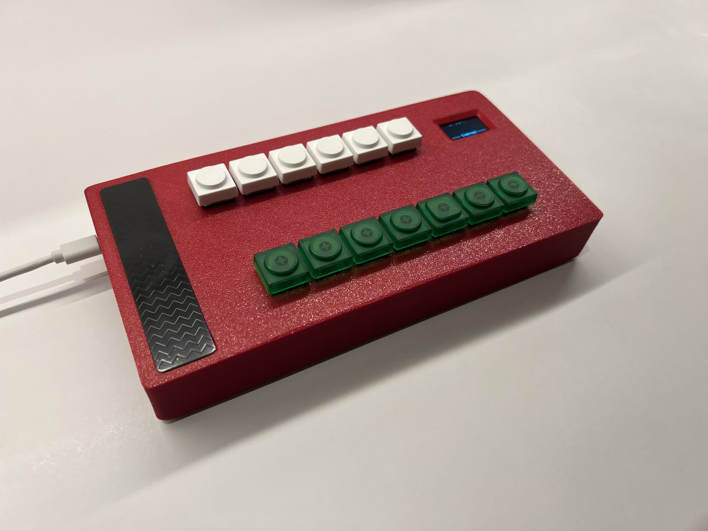

# Touchord

  

Touchord is an open source chord-generating MIDI controller featuring a touch bar interface. It is designed for musicians seeking versatile chordal playing and performance options and for makers looking for a highly modifyable product with a realistic and fun use.

## [TOUCHORD DIY KIT PRE-ORDERS](https://daugdara.com/products/touchord-diy-kit)

## Motivation

Making music without formal training is hard. Learning theory takes time, and when the goal is to create and express ideas quickly, it can feel tedious. Chord progressions and harmony are crucial yet difficult to master; exploring by ear works, but entering complex chords on guitar or piano is slow. That is where chord‑generating synths and MIDI controllers help.

**Why not buy an existing similar device?** Many are closed‑source and built by unestablished companies with limited support histories. When projects are abandoned or parts become unavailable, devices turn into e‑waste.

Touchord addresses these problems. Components are common, 3D‑printable, or manufacturable at a reasonable cost, thus repairs and replacements remain feasible. Open development also streamlines bug fixes and issue tracking because contributors can help accelerate software improvements. And if we for some reason stop developing new updates or cannot contribute anymore, community still remains along with the source code and all the production files, keeping the project alive.

## Licensing and Legal Notice

**Copyright © 2026 MB Daugdara. All rights reserved.**

**Trademarks:**
- Touchord™ is a trademark of MB Daugdara
- Touchord™ logo is a trademark of MB Daugdara

**Intellectual Property:**
- The Touchord name and logo are the exclusive property of MB Daugdara
- Firmware is licensed under GNU General Public License v3.0
- The 3D model design files and PCB Files are licensed under CERN-OHL-S-2.0
- The license does not grant rights to use the company name or logo

**Restrictions:**
- You may not use the company name or logo to endorse derivative commercial works
- You must include this notice when distributing modified versions
- See LICENSE file for full CERN-OHL-S-2.0 terms

## Features

- **Three Operating Modes:**
  - **Strum Mode:** Harp style playing for plucked synths.
  - **Omni Mode:** An omni-chord style play mode mimicking the strumming of an omnichord.
  - **Composer Mode:** Allows adjustment of chord qualities directly via the touch bar for chord customization.
  - **Perform Mode:** Uses the touch bar’s pressure sensitivity for expressive live performances.
  - **Drum Mode:** A simple mode with chromatically mapped keys and the touch bar controlling velocity.

- **Chord Layout:**
  - Each key corresponds to a chord degree in a musical key.
  - Supports custom musical keys and customizable chords on each key.

- **Hardware:**
  - Uses the RP2350 microcontroller chip.
  - Programmed with the PicoSDK in C.
  - Cherry MX style mechanical switches.
  - 6 control buttons.
  - 7 chord keys sized 3u, equipped with 3u plate-mounted stabilizers for enhanced stability.
  - Touch bar: [Trill Bar by Bella](https://bela.io/products/trill/) ([GitHub](https://github.com/BelaPlatform/Trill)) providing multi-touch and pressure sensing.
  - Display: Standard 0.96" 128x64 OLED SSD1306 screen.

- **Enclosure:**
  - Combination of 3D printed carbon fiber reinforced PETG base and CNC machined aluminum top.
  - Optionally, the top can also be fabricated via 3D printing.

- **Connectivity:**
  - USB Type-C MIDI support.
  - TRS MIDI support (User switchable in software):
    - **TRS Type A (Standard MIDI TRS)**
    - **TRS Type B (Roland TRS MIDI)**

---

## Contribution

Check `CONTRIBUTING.md` for more info.

### AI Usage

AI usage on Bug Fixes and Code Auditing is welcome, if done with proper testing, cleanup and no blind trust. Please disclose AI usage in Pull Requests.
Features are better left for humans to write.

---

## Showcase

## User Showcase

## Projects based on Touchord

### "Ghetto" Touchord made using Pico 2W by [nlpeeee](https://github.com/nlpeeee/TCw)

## Special Thanks

I wanted to share my experience with [PCBWay](https://www.pcbway.com/), as I used it for prototyping and although they have helped me produce one of the batches at their cost, this opinion is my own. My choice to go with PCB Way was first, and only then did I ask for their help.

They have been an amazing experience, especially comparing to their biggest competitors, as for the same price I was able to manufacture boards of way better quality. I couldn't have made this project without PCBA services, as soldering small footprint components are too time consuming and expensive to setup.

What I have found is that the quality of thru-holes, soldering are way better and feel like an actual professional product instead of a draft board. Also, the fact that components can be sourced from anywhere, it doesn't have to be a specific selection of components and other components costing more than a standard price, unlike their competitors. Also, their care of the customer surprised me as I was asked multiple times, whether the components I chose are the right ones (There have been issues with the BOM), and one of the more suprising questions I got was whether the color of soldermask could be changes, as properties of black soldermask wouldn'tve played well with my design. That was amazing, as other service providers just apply blind trust and manufacture the board.

Overall, an amazing experience, especially for anyone looking to prototype PCB's that don't feel like toys, guaranteeing that what you designed will be what you get.

---

*Find the Trill Bar by Bella:* [https://bela.io/products/trill/](https://bela.io/products/trill/)
*Trill Bar GitHub repository:* [https://github.com/bela-platform/trill](https://github.com/BelaPlatform/Trill)
